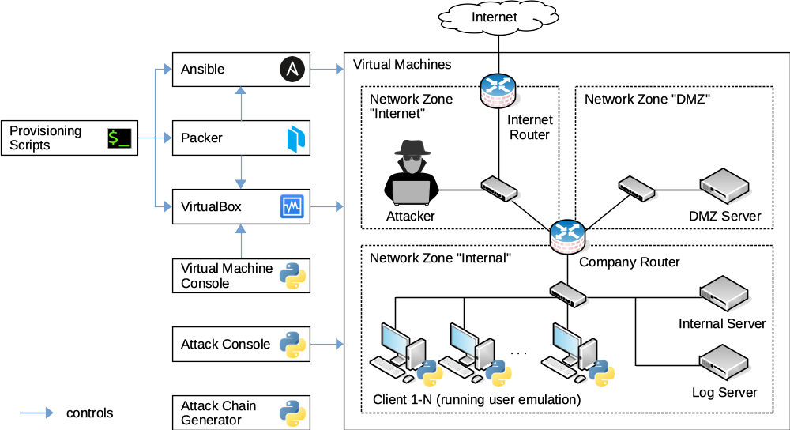

[](https://github.com/fkie-cad/socbed/actions/workflows/socbed-unittest.yml?query=branch%3Amain)
[](https://github.com/fkie-cad/socbed/actions/workflows/socbed-systemtest.yml?query=branch%3Amain)

# SOCBED

SOCBED is a Self-contained Open-source Cyberattack experimentation testBED that uses virtual machines to simulate a small company's network including benign user activity, various cyberattacks, and a central collection of log data.

SOCBED can be used for generating realistic log or network traffic datasets for product or method evaluations.
Other use cases include research and training in intrusion detection, log management, digital forensics, or awareness.

The virtual machines are built and configured from scratch using provisioning scripts.
All necessary operating system images and software are downloaded automatically during the build process, except for a Windows 10 ISO image, which has to be downloaded manually first.

After the build process is finished, SOCBED sessions can be started, controlled, and terminated using the apps `vmconsole` and `attackconsole` (see below).



## System Requirements

* Physical host with Linux or macOS. Note: Running SOCBED (and therefore VirtualBox) in a virtual machine might work as well but was not tested.
* Python v3.9 or newer
* RAM: 16 GB minimum, 32 GB recommended
* CPU: Quad-core with hardware support for virtualization
* HDD: 50 GB free, SSD strongly recommended

More resources are required depending on the desired number of simulated clients.
The numbers above are valid for small simulations with 1-3 clients.

## Installation

The installation instructions below were tested on a fresh Ubuntu 24.04 LTS system.
Please adhere strictly to the instructions as different software versions might not work as expected.

```sh
# Install VirtualBox and configure the management network interface
sudo apt install virtualbox virtualbox-ext-pack
vboxmanage hostonlyif create # should create vboxnet0, else adapt following lines
vboxmanage hostonlyif ipconfig vboxnet0 --ip 192.168.56.1 --netmask 255.255.255.0
vboxmanage dhcpserver modify --ifname vboxnet0 --disable

# Install packer v1.6.3
export VER="1.6.3"
sudo wget https://releases.hashicorp.com/packer/${VER}/packer_${VER}_linux_amd64.zip
sudo unzip packer_${VER}_linux_amd64.zip -d /usr/local/bin

# Install requirements for the python package "cryptography",
# see https://cryptography.io/en/latest/installation/
sudo apt install build-essential libssl-dev libffi-dev python3-dev

# Optional: Install packages for 1337 "message of the day" banner in the attackconsole
sudo apt install cowsay fortunes

# Create and activate a Python Virtual Environment
sudo apt install virtualenv
virtualenv -p python3 ~/.virtualenvs/socbed
source ~/.virtualenvs/socbed/bin/activate

# Download and install SOCBED in the virtual environment
git clone git@github.com:fkie-cad/socbed.git
cd socbed/
pip install -r requirements.txt
pip install --editable .
```

Before building SOCBED, you need to manually download Windows 10 and adapt a provisioning script:
- Download a Windows 10 64-bit ISO image from Microsoft (see [here](https://www.microsoft.com/en-us/software-download/windows10ISO)). We are currently using version 21H2 (November 2021) in English for testing, but other versions should work as well.
- Calculate the MD5 hash of this ISO file using `md5sum <filename>.iso`.
- Open the file `provisioning/packer/client.json` and change the values of the fields `iso_url` and `iso_checksum` under `variables` (at the bottom of the file) accordingly.

The script below will execute everything required to build and configure each respective machine, including snapshotting.
It will download the remaining ISO files, automatically boot the machines and provision the necessary versions of software dependencies with no interaction needed.
Be aware that this will take multiple (3-5) hours to complete, depending on your hardware and Internet speed.

```sh
# Current directory must be root directory of the SOCBED repository
./tools/build_vms
```
In case of an error, simply restart the script, it will recognize previously built machines and continue where it left off.
Note that the order in which the machines are built is not arbitrary, and deleting and rebuilding e.g. the Log Server after all machines have been built will result in loss of critical functionality.

After these steps, you can run the commands `vmconsole`, `attackconsole`, or `generateattackchains` within the virtual environment and work with the testbed (see example below).

## Testing

Activate the virtual environment if you haven't done it yet:
```sh
source ~/.virtualenvs/socbed/bin/activate
```

Run all unit tests from the repository root directory:
```sh
tox -- -m "not systest"
```

If they succeed, you can run all stable system tests.

Attention: System tests will start and stop the virtual machines several times and can take up to an hour to complete!
Do not use SOCBED VMs or apps (`attackconsole`, `vmconsole`) while system tests are running.

```sh
tox -- -m "systest and not unstable"
```
(Unstable systests sometimes fail despite correct SOCBED functionality. We're working on it.)

## Example

This first example shows how to manually start a session and run some attacks.

```sh
# Activate virtual environment
source ~/.virtualenvs/socbed/bin/activate

# Start the virtual machines
vmconsole -c start_session

# Please allow ~5 minutes for the VMs to start. The Windows clients
# will reboot twice to change their hostname and join the domain.

# Start the attackconsole and run some commands
attackconsole
attackconsole > help
attackconsole > ls
attackconsole > use infect_email_exe
attackconsole (infect_email_exe) > options
attackconsole (infect_email_exe) > set addr client2@localdomain
attackconsole (infect_email_exe) > run
attackconsole (infect_email_exe) > back
attackconsole > use c2_change_wallpaper
attackconsole (c2_change_wallpaper) > run
attackconsole (c2_change_wallpaper) > back
attackconsole > exit

# Close and restore the virtual machines
vmconsole -c close_session

# Deactivate virtual environment
deactivate
```

Alternatively, simulations can be completely scripted.
There is an example script in the repository:

```sh
source ~/.virtualenvs/socbed/bin/activate
./run_sample_simulation
```

## Cleaning up failed sessions

In case sessions crash for some reason, you might end up with several Client clones and several automatically generated snapshots named `Backup*`.
To clean up the mess, run the script `tools/cleanup_failed_session` to reset all SOCBED VMs to their original state and remove all superfluous clones and snapshots.

## Login information

For all Linux machines, the Linux username is either `root` (Internet Router, Company Router, Attacker) or `breach` (Log/Internal/DMZ Server) and the password is `breach`.
SSH access is allowed via all network interfaces.
Attention: The SSH Server on the Company Router and the Internet Router is running on the non-standard port 222!

There is also an SSH server running on the Client (only accessible via the management network).
Login is only possible with username `ssh` and password `breach`.

The Samba domain controller running on the Internal Server has 101 user accounts:
The domain administrator with username `administrator` and password `breach` and 100 user accounts named `client1` through `client100`, all with password `breach`.
The domain name is `BREACH`.

The following table shows all available web interfaces and their logins:

| Machine         | Service    | Username | Password | URL                                  |
| --------------- | ---------- | -------- | -------- | ------------------------------------ |
| Company Router  | IPFire     | admin    | breach   | https://192.168.56.10:444/           |
| DMZ Server      | phpMyAdmin | root     | breach   | http://192.168.56.20/phpmyadmin/     |
| Log Server      | Kibana     | -        | -        | http://192.168.56.12:5601/app/kibana |
| Internet Router | IPFire     | admin    | breach   | https://192.168.56.30:444/           |

## Documentation

For more information, please see our ACSAC'21 paper:

Uetz, R., Hemminghaus, C., Hackländer, L., Schlipper, P., & Henze, M. (2021). Reproducible and Adaptable Log Data Generation for Sound Cybersecurity Experiments [Conference paper]. Annual Computer Security Applications Conference. https://doi.org/10.1145/3485832.3488020, https://arxiv.org/abs/2111.07847.

Further documentation can be found in the [docs](docs/) directory.

## Contributors

SOCBED was created by [Fraunhofer FKIE](https://www.fkie.fraunhofer.de/)'s department of Cyber Analysis & Defense (CA&D) as part of the [BMBF](https://www.bmbf.de/)-funded project [PA-SIEM](https://www.forschung-it-sicherheit-kommunikationssysteme.de/projekte/pa-siem).

We welcome contributions and suggestions!
If you would like to contribute, please let us know.

## License

The files in this repository are licensed under the GNU General Public License Version 3. See [LICENSE](LICENSE) for details.

If you are using SOCBED for your academic work, please cite the paper mentioned above.
